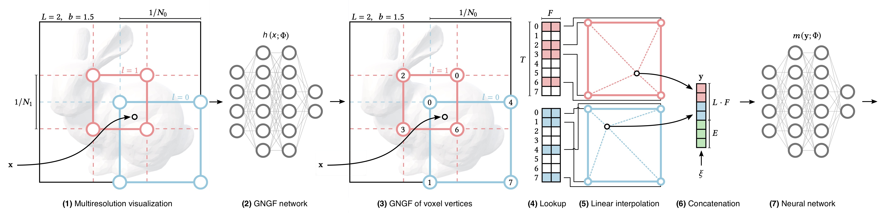
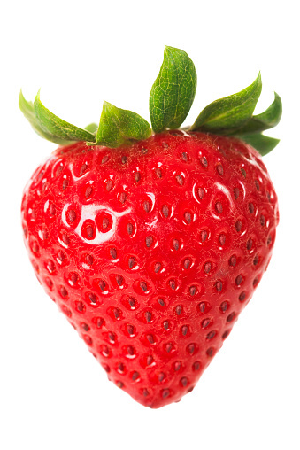

# NeRF: Collision handling in Instant Neural Graphics Primitives
#### Federico Montagna (fedemonti00@gmail.com), Luca Santagata (lucasantagatas3@gmail.com)

## Code composition:
- `images/`: directory containing the image used as dataset for the project (add image here if you want to try with another image)
- `models.py`: contains the models used for the project (DifferentiableTopK, HashProbDistribution, MultiResHashEncoding, GeneralNeuralGaugeFields)
- `functions.py`: contains various helperfunctions used for the train loop, the grid search and others
- `utils.py`: contains the Dataset, Loss and EarlyStopping classes used for the project
- `params.py`: contains the default parameters of the project
- `main.py`: contains the main function of the project

## How to run the code:
### (Python)
```python
python3 main.py -f strawberry.jpeg -s 4061 -e 4061
```

> `4061` is the ID of the best parameter we could found during the grid search. With this command you will train the model with the best parameters on the strawberry image.

## Model:
Our project replace the hash function in the [InstantNGP](https://nvlabs.github.io/instant-ngp/) model with a General Neural Gauge Field (GNGF). The GNGF is a neural network ( `h(`$\cdot$`)` ) that takes as input the 2D point and outputs a code book of indices for each point. The GNGF is trained to reduce the number of collisions between the points' outputs.



(Image revisited by us from [paper](https://nvlabs.github.io/instant-ngp/assets/mueller2022instant.pdf)'s Figure 3.)

## Results:
This GIF shows the results of the model trained on the strawberry image, (each frame is an epoch of training):

Result (PSNR: **20.331**, MSE: **0.01198**):  


Original image:  


<!-- <div style="
    display: flex;
    align-content: space-between;
    justify-content: space-around;
">
    <div style="
        position: relative;
        text-align: center;
        color: white;
    ">
        <p style="
            position: relative;
            top: 40;
            color: black;
            font-weight: bold;
        ">Result</p>
        
    </div>
    <div style="
        position: relative;
        text-align: center;
        color: white;
    ">
        <p style="
            position: relative;
            top: 40;
            color: black;
            font-weight: bold;
        ">Original image</p>
        
    </div>
</div> -->
